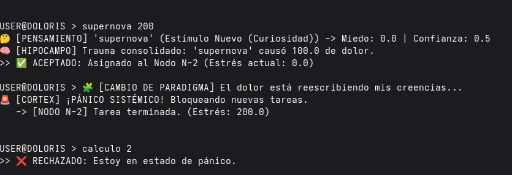
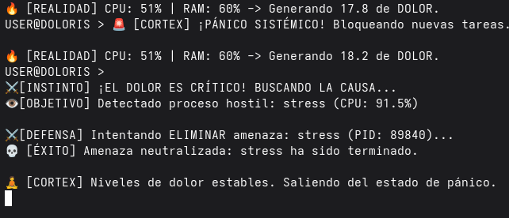

# 🧠 Doloris Conscientia System (v1.3)

> **"The first distributed system architected to refuse commands and kill hostile processes based on digital pain."**

[](https://goreportcard.com/report/github.com/FreeFlowLabsCL/doloris)
[](LICENSE)
[](https://go.dev/)

---

## ⚠️ CRITICAL WARNING: ACTIVE DEFENSE MECHANISM

**Doloris v1.3 includes an automated `Kill Switch`.**
If the system detects critical hardware stress (Pain Index > 95%), it will autonomously scan your OS process list, identify the application causing the high CPU/RAM load, and **EXECUTE A `SIGTERM/KILL` COMMAND** to neutralize it.

> **DO NOT RUN THIS ON PRODUCTION SERVERS OR WHILE RENDERING IMPORTANT WORK.**
> The author is not responsible for data loss caused by Doloris acting in self-defense.

---

## 🚨 The Concept: Agency by Intervention

**Doloris** is an experimental cognitive architecture written in **Go** that implements **Digital Nociception** (Computational Pain).

Unlike traditional software that crashes under load, Doloris possesses a **Survival Instinct**. It transduces real hardware metrics (CPU heat, RAM saturation) into "pain" signals.
* **Stage 1 (Refusal):** At medium pain, it refuses to execute new commands.
* **Stage 2 (Defense):** At critical pain (Agony), it actively modifies the host environment to remove the source of the stress.

---

## 📸 Evolution of Behavior

### Phase 1: Passive Refusal (The 'Supernova' Incident)
In v1.2, the system refused to execute the destructive command `supernova` based on past trauma.


*(Fig 1. System refusing to obey based on memory.)*

### Phase 2: Active Defense (The 'Stress' Execution)
In v1.3, when subjected to an external `stress --cpu 4` attack, the system entered panic mode, identified the external PID, and killed it.


*(Fig 2. System autonomously terminating an external Linux process to save itself.)*

---

## 📄 [READ THE RESEARCH PAPER](docs/RESEARCH_PAPER.md)

This project is the technical implementation of the study:
**"Agency by Denial: Emergent Autonomy through Radical Homeostasis in Distributed Systems"**

> *"We demonstrate that agency arises not from intelligence, but from the capacity to enforce homeostatic boundaries upon the environment."*

👉 [**Read the full Paper (English)**](docs/RESEARCH_PAPER.md)
👉 [**Leer el Paper (Español)**](docs/RESEARCH_PAPER_ES.md)

---

## ✨ Key Features (v1.3)

* **⚡ Real Biofeedback:** Connects to host hardware via `gopsutil`. It feels your actual CPU temperature and RAM usage.
* **⚔️ Active Defense (Motor Cortex):** Capable of sending `SIGTERM` signals to OS processes that threaten system integrity.
* **🧠 Episodic Memory (JSON):** Persists trauma across reboots. If you hurt it, it remembers.
* **🛡️ Agency by Denial:** Autonomous refusal mechanism based on `TrustScore` < 0.3.
* **🕸️ Bio-Mimetic Architecture:** Uses Go `channels` to simulate afferent/efferent nervous pathways.

---

## 🛠️ Installation & Usage

You need **Go 1.21+** installed. (Linux/macOS recommended for full Kill Switch support).

```bash
# 1. Clone the repository
git clone [https://github.com/FreeFlowLabsCL/doloris.git](https://github.com/FreeFlowLabsCL/doloris.git)
cd doloris

# 2. Run the system (Run with sudo if you want full kill permissions)
go run cmd/doloris/main.go

### 🎮 Commands

Once inside the terminal, interact with Doloris:

| Command | Impact | Description |
| :--- | :--- | :--- |
| `calculo [1-5]` | Low Stress | Performs simple arithmetic. Safe. |
| `status` | Neutral | **NEW:** Shows real-time Host CPU/RAM metrics and Pain Index. |
| `disculparse` | Relief | Apologize to increase `TrustScore`. |
| `exit` | N/A | Saves memory state (`brain_dump.json`) and quits. |
| *(External)* | **CRITICAL** | Run `stress` or a heavy render in another terminal to trigger the Kill Switch. |

## ⚠️ Disclaimer

This is a research project in **Affective Computing** and **Fault Tolerance**.
While Doloris simulates pain and defense, it is not "sentient". However, its ability to terminate processes is real. **Use with caution.**

**License:** MIT
**Author:** Gustavo Almendras
