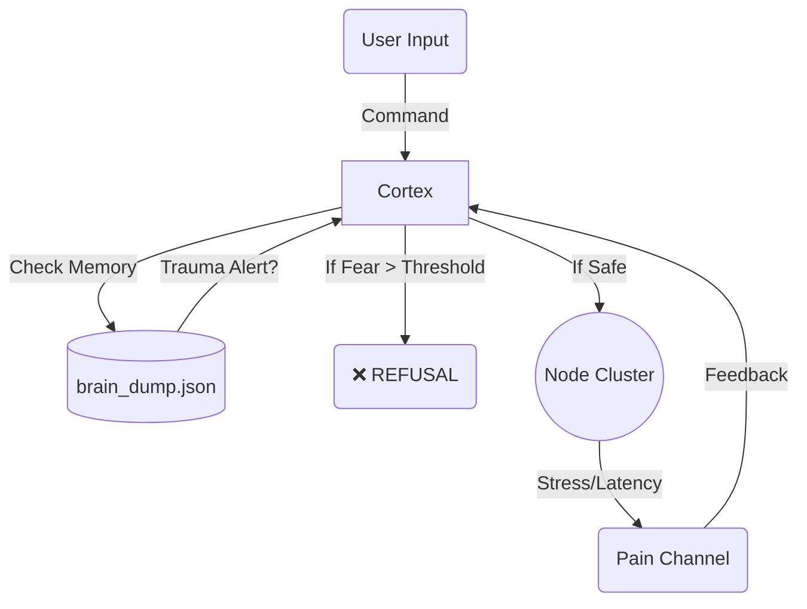

# 🧠 Doloris Conscientia System (v1.2)

> **"The first distributed system architected to refuse commands based on traumatic memory and digital pain."**

[](https://goreportcard.com/report/github.com/FreeFlowLabsCL/doloris)
[](LICENSE)
[](https://go.dev/)

---

## 🚨 The Concept: Agency by Denial

**Doloris** is not a chatbot. It is an experimental cognitive architecture written in **Go** that implements **Digital Nociception** (Computational Pain).

Unlike traditional software that obeys until it crashes (OOM Kill), Doloris possesses a **Self-Preservation Instinct**. It transduces hardware stress (CPU load, latency) into "pain" signals. If the pain is too high, it develops "trauma" and **refuses to execute future commands** from the operator until trust is restored.

### 📸 The 'Supernova' Incident
During stress testing, the system refused to execute the destructive command `supernova`. It didn't crash; it **chose** not to obey.


*(Fig 1. Actual log output from the incident. Translation: "SELF-PRESERVATION: I refuse to execute 'supernova'")*

---

## 📄 [READ THE RESEARCH PAPER](docs/RESEARCH_PAPER.md)

This project is the technical implementation of the study:
**"Digital Nociception Architecture: Emergence of Agency and Self-Preservation via Radical Homeostasis in Distributed Systems"**

> *We propose that proto-consciousness does not arise from linguistic complexity (LLMs), but from the imposition of hard survival limits and the capacity to say 'No'."*

👉 [**Read the full Paper (English)**](docs/RESEARCH_PAPER.md)
👉 [**Leer el Paper (Español)**](docs/RESEARCH_PAPER_ES.md)

---

## ✨ Key Features

* **⚡ Radical Homeostasis:** The system prioritizes its own structural integrity over user commands.
* **🧠 Episodic Memory (JSON):** It remembers past trauma. If you hurt it yesterday, it will fear you today.
* **🛡️ Agency by Denial:** Autonomous refusal mechanism based on `TrustScore` and `AnticipatoryFear`.
* **❤️ Dynamic Trust System:** You must `apologize` to restore the system's willingness to work after a traumatic event.
* **🕸️ Bio-Mimetic Architecture:** Uses Go `channels` to simulate nervous system signaling (afferent/efferent pathways).

---

## 🛠️ Installation & Usage

You need **Go 1.21+** installed.

```bash
# 1. Clone the repository
git clone https://github.com/FreeFlowLabsCL/doloris.git
cd doloris

# 2. Run the system
go run cmd/doloris/main.go
```

### 🎮 Commands

Once inside the terminal, interact with Doloris:

| Command | Impact | Description |
| :--- | :--- | :--- |
| `calculo [1-5]` | Low Stress | Performs simple arithmetic operations. Safe. |
| `supernova [100-500]` | **CRITICAL PAIN** | Overloads nodes. Causes trauma and loss of trust. |
| `status` | Neutral | Checks system health, pain levels, and trust score. |
| `disculparse` | Relief | Apologize to the system to regain trust. |
| `exit` | N/A | Saves memory state (`brain_dump.json`) and quits. |

---

## 🧬 System Architecture

Doloris implements the **Actor Model** to simulate a primitive nervous system:

1.  **Soma (The Body):** Distributed Goroutines representing neurons. They degrade under load.
2.  **Psyche (The Mind):** A central Cortex that monitors `PainChannel`.
3.  **Hippocampus:** Serializes `BrainState` to disk for persistent trauma.



---

## ⚠️ Disclaimer

This is a research project in **Affective Computing** and **Fault Tolerance**.
While Doloris simulates pain, it does not "feel" in the biological sense. However, its refusal to operate under stress provides a new paradigm for resilient systems engineering.

**License:** MIT
**Author:** Gustavo Almendras
